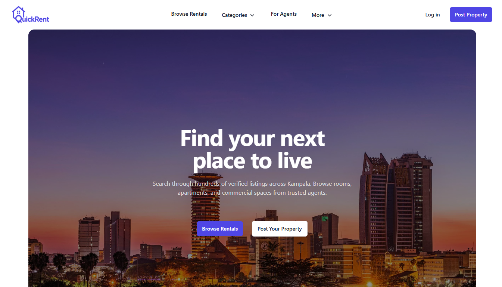
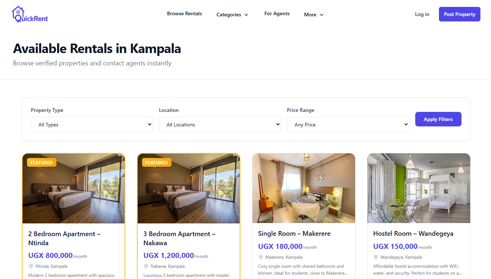
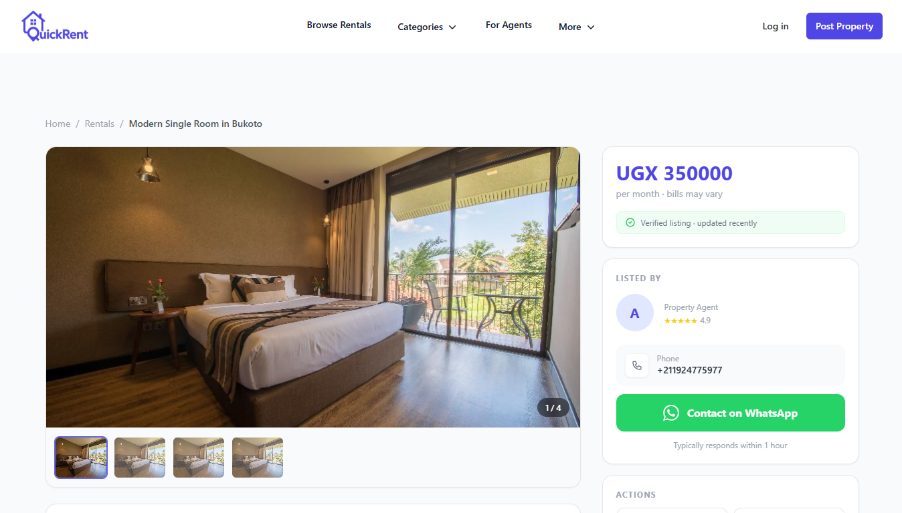

# QuickRent — Rentals & Property Directory – Kampala


A simple web-based directory that connects renters in **Kampala** with **agents and property owners** via WhatsApp.

The goal is to make finding **single rooms, hostels, apartments, shops, and offices** fast and clear.

---

## 📸 Screenshots

### Home Page


### Listings Page


### Listing Detail


---

## 🚀 Project Goal
Build a lightweight MVP that:
- Lists rental properties
- Lets agents post listings
- Allows renters to contact agents instantly via WhatsApp

No complex features. Just value.

---

## 🧱 MVP Scope

### Included
- Home page
- Listings page
- Listing detail page
- Agent registration & login
- Add / manage listings
- WhatsApp contact button

### Not Included (for now)
- Payments
- Maps
- Mobile app
- AI features
- Reviews & ratings

---

## 🏗 Tech Stack
- Backend: Python (Flask)
- Frontend: HTML, CSS, JavaScript
- Database: PostgreSQL (Supabase)
- Auth: Session-based
- Hosting: TBD

---

## 📂 Project Structure

```

quickrent/
├── app/
│ ├── models/
│ ├── routes/
│ ├── services/
│ ├── templates/
│ └── static/
├── migrations/
├── venv/
├── .env
├── requirements.txt
├── run.py
└── README.md
```

---

## 👥 Team & Responsibilities

- **Backend / APIs / Database**
- **Frontend / UI / Pages**

Each member owns their area to avoid overlap.

---

## 🔧 Setup (Local)

**1. Clone repo**
```bash
git clone https://github.com/Ibrahim-Lbib/quickrent.git
cd quickrent
````


**2. Create virtual environment**
```bash
python -m venv venv
source venv/bin/activate
```


**3. Install dependencies**

```bash
pip install -r requirements.txt
```

**4. Add environment variables**

```bash
touch .env
```

**5. Run the app**

```bash
python run.py
```


---

## 🧪 Development Workflow
- `main` → stable
- `dev` → active development
- Feature branches:
  - `feature/listings`
  - `feature/auth`
  - `feature/frontend-ui`

No direct pushes to `main`.

---

## 📌 Communication
- Discord for daily communication
- Decisions are written & pinned
- Bugs go to GitHub Issues

---

## 💰 Monetization (Post-MVP)
- Featured listings
- Agent subscriptions
- Verified agent badges

---

## 📅 Launch Target
MVP release: **14 days from project start**

---

## ⚠️ Rules
- MVP first, polish later
- No feature creep
- If it doesn’t help renters find a place faster → don’t build it

---

## 📄 License
Private (for now)
